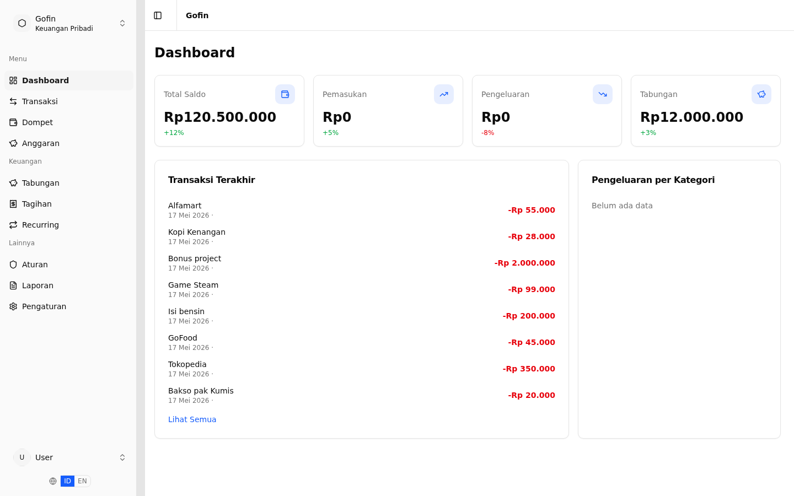
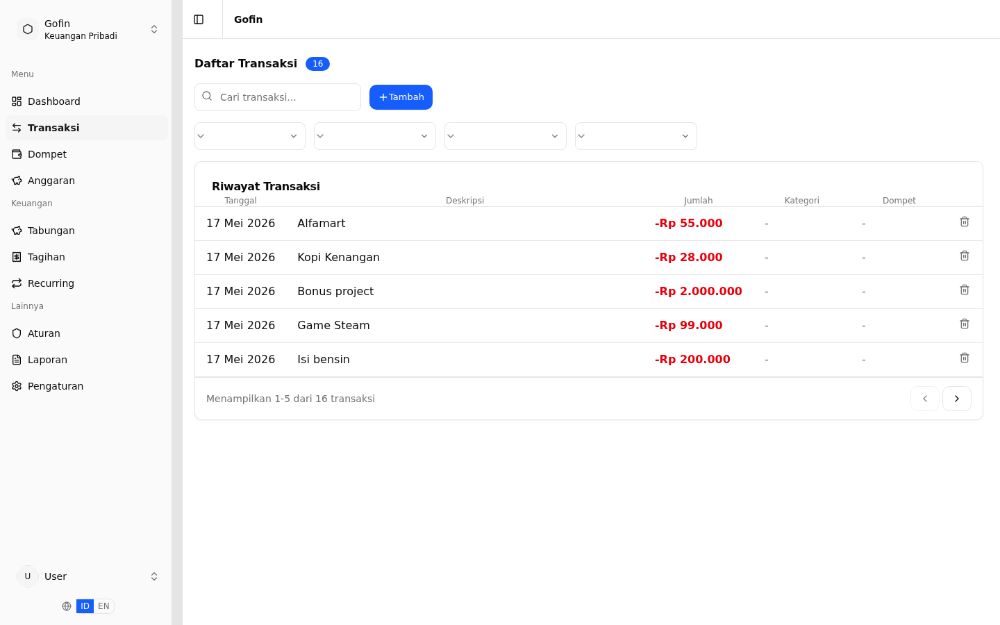
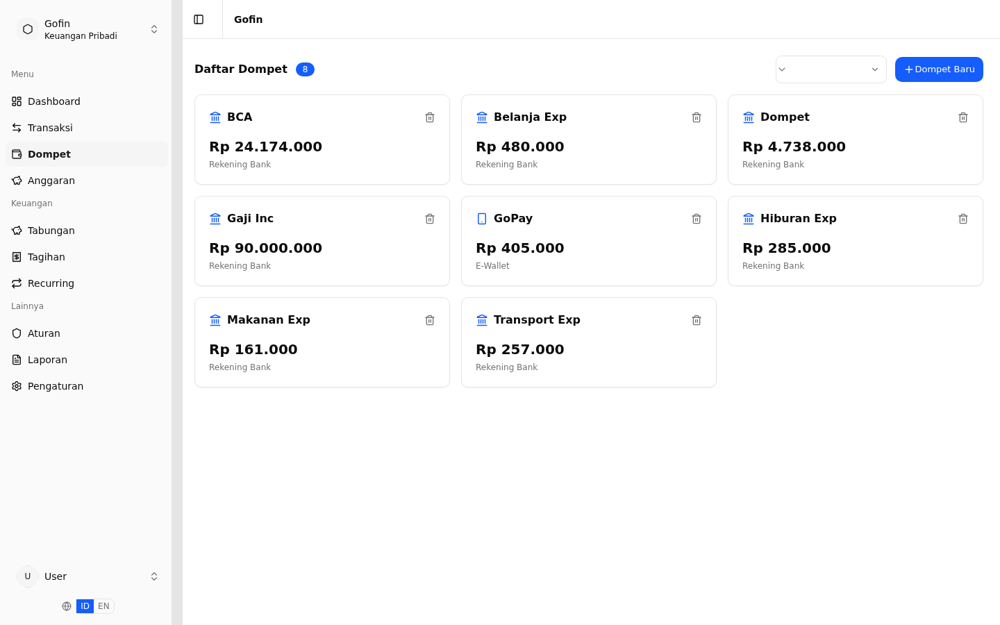
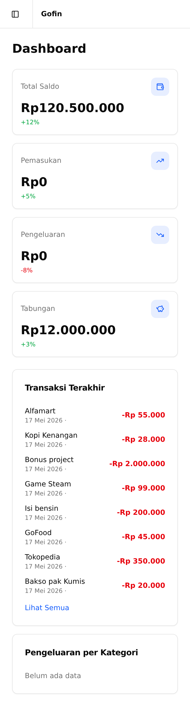
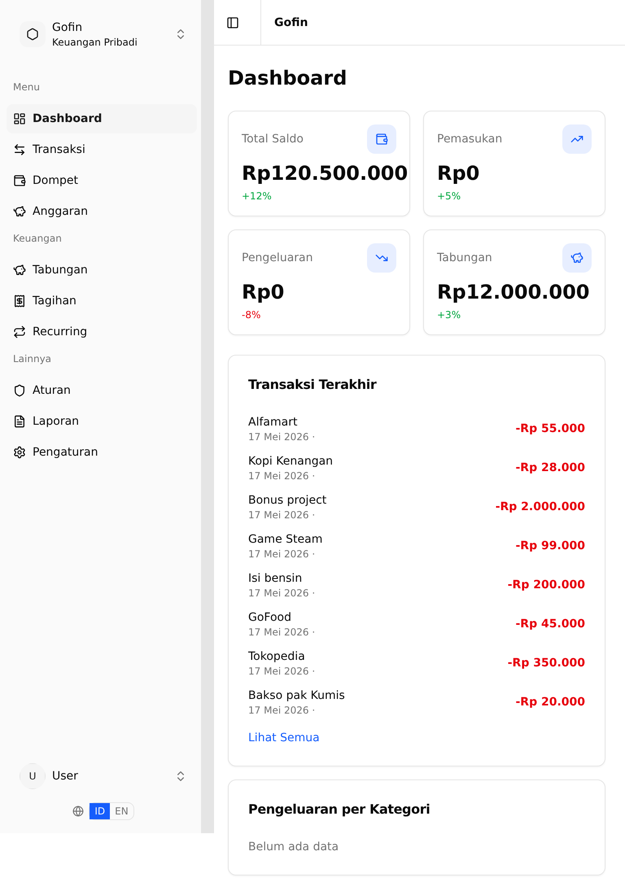
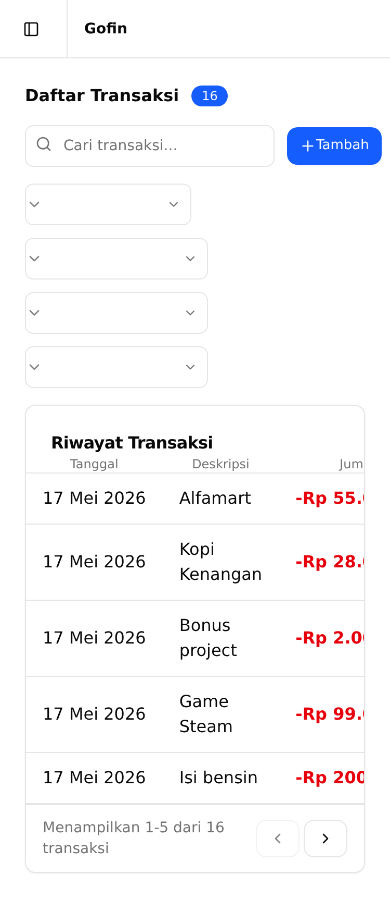
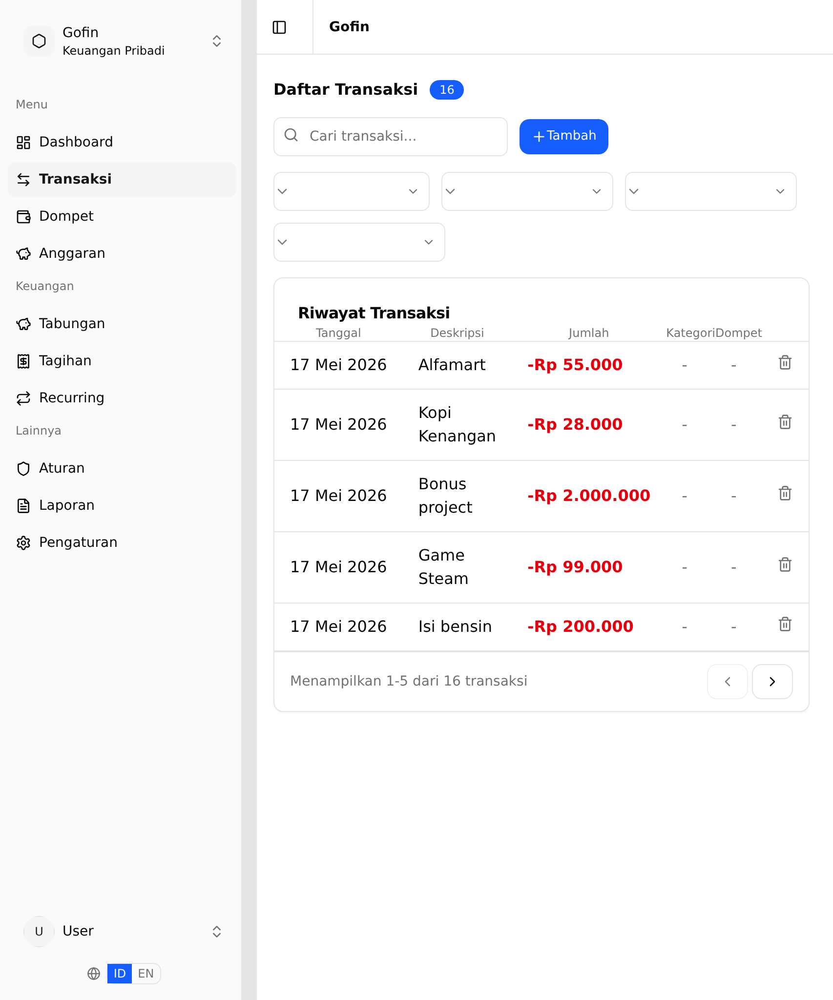

# Gofin

> Self-hosted personal finance tracker with double-entry bookkeeping, hierarchical RBAC, and automated budgeting.

[](https://ajianaz.github.io/gofin-full/)
[](https://go.dev/)
[](LICENSE)

## Quick Start (Pre-built Images)

No build required — just Docker Compose + env file.

```bash
# 1. Download compose file and env template
mkdir gofin && cd gofin
curl -O https://raw.githubusercontent.com/ajianaz/gofin/develop/deployments/docker/docker-compose.selfhost.yml
curl -o .env https://raw.githubusercontent.com/ajianaz/gofin/develop/api/.env.example

# 2. Edit .env — REQUIRED settings:
#    AUTH_JWT_SECRET=<random-string-min-32-chars>
#    DOMAIN=your-domain.com
#    STATIC_CRON_TOKEN=<random-string>

# 3. Start
DOCKER_IMAGE_API=ajianaz/gofin-api:develop \
DOCKER_IMAGE_WEB=ajianaz/gofin-web:develop \
docker compose -f docker-compose.selfhost.yml up -d
```

Open `https://your-domain` — Caddy handles HTTPS automatically.

> **Develop images** (`:develop`) are built from the `develop` branch on every push.
> For stable releases, use `:latest` (built from `main`).

<details>
<summary>⚙️ All Configuration Options</summary>

| Variable | Default | Required | Description |
|----------|---------|----------|-------------|
| `DOMAIN` | `localhost` | ✅ | Your public domain or IP |
| `AUTH_JWT_SECRET` | — | ✅ | Min 32 characters |
| `STATIC_CRON_TOKEN` | — | ✅ | Random string for cron auth |
| `ADMIN_EMAIL` | — | Optional | Auto-create admin on first start |
| `ADMIN_PASSWORD` | — | Optional | Admin password (min 8 chars) |
| `DB_PASSWORD` | `gofin_secret` | Optional | PostgreSQL password |
| `AUTH_ALLOW_REGISTRATION` | `false` | Optional | Allow self-registration |
| `DOCKER_IMAGE_API` | `ajianaz/gofin-api:latest` | Optional | Override API image |
| `DOCKER_IMAGE_WEB` | `ajianaz/gofin-web:latest` | Optional | Override web image |
| `TZ` | `UTC` | Optional | Timezone (e.g. `Asia/Jakarta`) |

</details>

<details>
<summary>🔧 Build from Source</summary>

```bash
git clone https://github.com/ajianaz/gofin-full.git
cd gofin-full
cp api/.env.example .env
# Edit .env — set AUTH_JWT_SECRET, DOMAIN, ADMIN_EMAIL
make docker-selfhost
```

This builds images locally instead of pulling from Docker Hub.

</details>

## Screenshots

<details>
<summary>📊 Desktop (1440×900)</summary>





👉 [View all 26 screenshots](docs/assets/images/screenshots/)
</details>

<details>
<summary>📱 Mobile & Tablet</summary>

| Mobile (375×812) | Tablet (768×1024) |
|---|---|
|  |  |
|  |  |

👉 [View all in docs](https://ajianaz.github.io/gofin-full/screenshots)
</details>

## Features

- 💰 **Double-entry bookkeeping** — source + destination wallet for full auditability
- 🛡️ **21-level RBAC** — group roles (read-only to owner) + wallet roles (viewer/editor/owner)
- 📊 **Analytics** — spending by category/period, net worth tracking, budget analysis
- 🔄 **Automation** — rules engine, recurring transactions, bill tracking
- 🌍 **i18n** — Indonesian + English, dark mode, responsive design
- 🔐 **Security** — JWT, OAuth2 (Google/GitHub), rate limiting, password policy
- 🐳 **Docker** — single `docker compose` command, auto-HTTPS via Caddy
- 📤 **Export** — CSV + OFX format
- 🔔 **Real-time** — Server-Sent Events notifications

## Tech Stack

| Layer | Technology |
|-------|-----------|
| Backend | Go 1.25, Fiber v2, PostgreSQL 17, Redis 7 |
| Frontend | SvelteKit 5, Tailwind CSS 4, shadcn-svelte |
| Auth | JWT, OAuth2 (Google, GitHub), Keycloak OIDC |
| Deploy | Docker Compose, Caddy (auto-HTTPS) |

## Documentation

📖 **Full documentation** at [ajianaz.github.io/gofin-full](https://ajianaz.github.io/gofin-full/)

- [Getting Started](https://ajianaz.github.io/gofin-full/getting-started) — Deploy in minutes
- [Features](https://ajianaz.github.io/gofin-full/features) — Complete feature overview
- [Architecture](https://ajianaz.github.io/gofin-full/architecture) — System design & data flow
- [Configuration](https://ajianaz.github.io/gofin-full/configuration) — All environment variables
- [Deployment](https://ajianaz.github.io/gofin-full/deployment) — Production deployment guide
- [Security](https://ajianaz.github.io/gofin-full/security) — Security features & hardening
- [RBAC](https://ajianaz.github.io/gofin-full/rbac) — Permission system explained
- [API Reference](https://ajianaz.github.io/gofin-full/api/) — OpenAPI 3.0 specification (135 endpoints)

## Project Structure

```
gofin-full/
├── api/                  # Go backend
│   ├── internal/         # Handlers, services, repositories
│   ├── migrations/       # PostgreSQL migrations
│   └── tests/            # Unit + integration tests
├── web/                  # SvelteKit 5 frontend
│   ├── src/routes/       # File-based routing (43 pages)
│   └── tests/e2e/        # Playwright tests
├── docs/                 # VitePress documentation
├── deployments/docker/   # Docker Compose configs
└── scripts/              # Utility scripts
```

## Development

```bash
# Start infrastructure (PostgreSQL + Redis + API)
make docker-dev

# Start frontend dev server (port 5173)
make web-dev

# Run tests
make test-unit
make test-integration
```

See the [Development Guide](https://ajianaz.github.io/gofin-full/development) for full details.

## Contributing

Contributions are welcome! Please see [CONTRIBUTING.md](CONTRIBUTING.md) for guidelines.

## License

[Apache-2.0](LICENSE)
