# Database Relations — Mermaid Diagrams

---

> Visual database schema menggunakan Mermaid ERD. Bisa di-render di GitHub, VS Code (Markdown Preview Mermaid), atau online tools (mermaid.live).

---

## 1. Overview — All 47 Tables

```mermaid
erDiagram
    %% ========== AUTH & USER GROUP ==========
    users {
        int_unsigned id PK
        uuid objectguid
        varchar email
        varchar password
        varchar remember_token
        varchar reset
        tinyint blocked
        varchar blocked_code
        varchar mfa_secret
        bigint_unsigned user_group_id FK
    }

    user_groups {
        bigint_unsigned id PK
        varchar title
        timestamp created_at
        timestamp updated_at
        timestamp deleted_at
    }

    user_roles {
        bigint_unsigned id PK
        varchar title UK
    }

    group_memberships {
        bigint_unsigned id PK
        bigint_unsigned user_id FK
        bigint_unsigned user_group_id FK
        bigint_unsigned user_role_id FK
    }

    preferences {
        bigint_unsigned id PK
        bigint_unsigned user_id FK
        bigint_unsigned user_group_id FK
        varchar name
        text data
    }

    configuration {
        bigint_unsigned id PK
        varchar name
        text data
    }

    %% ========== ACCOUNTS (WALLETS) ==========
    accounts {
        bigint_unsigned id PK
        bigint_unsigned user_id FK
        bigint_unsigned user_group_id FK
        bigint_unsigned account_type_id FK
        varchar name
        boolean active
        text virtual_balance
        varchar iban
        text native_virtual_balance
    }

    account_types {
        bigint_unsigned id PK
        varchar type UK
    }

    account_meta {
        bigint_unsigned id PK
        bigint_unsigned account_id FK
        varchar name
        text data
    }

    %% ========== CURRENCIES ==========
    transaction_currencies {
        bigint_unsigned id PK
        varchar code UK
        varchar name
        varchar symbol
        tinyint decimal_places
        boolean active
    }

    currency_exchange_rates {
        bigint_unsigned id PK
        bigint_unsigned user_id FK
        bigint_unsigned user_group_id FK
        bigint_unsigned from_currency_id FK
        bigint_unsigned to_currency_id FK
        date date
        text rate
    }

    user_currency {
        bigint_unsigned id PK
        bigint_unsigned user_id FK
        bigint_unsigned transaction_currency_id FK
        boolean user_default
    }

    currency_user_group {
        bigint_unsigned id PK
        bigint_unsigned user_group_id FK
        bigint_unsigned transaction_currency_id FK
        boolean group_default
    }

    %% ========== TRANSACTIONS (TRIPLE LAYER) ==========
    transaction_groups {
        bigint_unsigned id PK
        bigint_unsigned user_id FK
        bigint_unsigned user_group_id FK
        varchar title
    }

    transaction_journals {
        bigint_unsigned id PK
        bigint_unsigned transaction_group_id FK
        bigint_unsigned user_id FK
        bigint_unsigned user_group_id FK
        bigint_unsigned transaction_type_id FK
        bigint_unsigned bill_id FK
        bigint_unsigned transaction_currency_id FK
        date date
        varchar description
        boolean reconciled
        text order
    }

    transactions {
        bigint_unsigned id PK
        bigint_unsigned transaction_journal_id FK
        bigint_unsigned account_id FK
        bigint_unsigned transaction_currency_id FK
        bigint_unsigned foreign_currency_id FK
        text amount
        text native_amount
        text foreign_amount
        text native_foreign_amount
        boolean reconciled
    }

    transaction_types {
        bigint_unsigned id PK
        varchar type UK
    }

    transaction_journal_meta {
        bigint_unsigned id PK
        bigint_unsigned transaction_journal_id FK
        varchar name
        text data
    }

    journal_links {
        bigint_unsigned id PK
        bigint_unsigned source_id FK
        bigint_unsigned destination_id FK
        bigint_unsigned link_type_id FK
    }

    link_types {
        bigint_unsigned id PK
        varchar name UK
    }

    %% ========== PIVOTS (MANY-TO-MANY) ==========
    tag_transaction_journal {
        bigint_unsigned tag_id FK
        bigint_unsigned transaction_journal_id FK
    }

    budget_transaction_journal {
        bigint_unsigned budget_id FK
        bigint_unsigned transaction_journal_id FK
    }

    category_transaction_journal {
        bigint_unsigned category_id FK
        bigint_unsigned transaction_journal_id FK
    }

    %% ========== BUDGETS ==========
    budgets {
        bigint_unsigned id PK
        bigint_unsigned user_id FK
        bigint_unsigned user_group_id FK
        varchar name
        boolean active
    }

    budget_limits {
        bigint_unsigned id PK
        bigint_unsigned budget_id FK
        bigint_unsigned transaction_currency_id FK
        date start
        date end
        text amount
        text native_amount
    }

    auto_budgets {
        bigint_unsigned id PK
        bigint_unsigned budget_id FK
        text amount
        text native_amount
    }

    available_budgets {
        bigint_unsigned id PK
        bigint_unsigned user_id FK
        bigint_unsigned user_group_id FK
        bigint_unsigned transaction_currency_id FK
        date start
        date end
        text amount
        text native_amount
    }

    %% ========== BILLS ==========
    bills {
        bigint_unsigned id PK
        bigint_unsigned user_id FK
        bigint_unsigned user_group_id FK
        bigint_unsigned transaction_currency_id FK
        varchar name
        text amount_min
        text amount_max
        text native_amount_min
        text native_amount_max
        date date
        date end_date
        varchar repeat_freq
    }

    %% ========== CATEGORIES & TAGS ==========
    categories {
        bigint_unsigned id PK
        bigint_unsigned user_id FK
        bigint_unsigned user_group_id FK
        varchar name
    }

    tags {
        bigint_unsigned id PK
        bigint_unsigned user_id FK
        bigint_unsigned user_group_id FK
        varchar tag
        date date
        text description
    }

    %% ========== PIGGY BANKS ==========
    piggy_banks {
        bigint_unsigned id PK
        bigint_unsigned account_id FK
        bigint_unsigned transaction_currency_id FK
        varchar name
        date target_date
        text target_amount
        text native_target_amount
        date start_date
    }

    piggy_bank_events {
        bigint_unsigned id PK
        bigint_unsigned piggy_bank_id FK
        bigint_unsigned transaction_journal_id FK
        text amount
        text native_amount
    }

    account_piggy_bank {
        bigint_unsigned id PK
        bigint_unsigned account_id FK
        bigint_unsigned piggy_bank_id FK
        text current_amount
        text native_current_amount
    }

    %% ========== RULES ==========
    rule_groups {
        bigint_unsigned id PK
        bigint_unsigned user_id FK
        bigint_unsigned user_group_id FK
        varchar title
        boolean active
    }

    rules {
        bigint_unsigned id PK
        bigint_unsigned rule_group_id FK
        bigint_unsigned user_id FK
        bigint_unsigned user_group_id FK
        varchar title
        boolean active
        boolean stop_processing
        text order
    }

    rule_triggers {
        bigint_unsigned id PK
        bigint_unsigned rule_id FK
        text trigger_type
        text trigger_value
        text order
    }

    rule_actions {
        bigint_unsigned id PK
        bigint_unsigned rule_id FK
        text action_type
        text action_value
        text order
    }

    %% ========== RECURRING ==========
    recurrences {
        bigint_unsigned id PK
        bigint_unsigned user_id FK
        bigint_unsigned user_group_id FK
        bigint_unsigned transaction_type_id FK
        varchar title
        text repeat_freq
        date first_date
        date latest_date
        boolean active
    }

    recurrence_repetitions {
        bigint_unsigned id PK
        bigint_unsigned recurrence_id FK
        date transaction_date
    }

    recurrence_transactions {
        bigint_unsigned id PK
        bigint_unsigned recurrence_id FK
        bigint_unsigned source_account_id FK
        bigint_unsigned destination_account_id FK
        bigint_unsigned transaction_currency_id FK
        bigint_unsigned foreign_currency_id FK
        bigint_unsigned budget_id FK
        bigint_unsigned category_id FK
        bigint_unsigned piggy_bank_id FK
        bigint_unsigned bill_id FK
        text amount
        text foreign_amount
        varchar description
    }

    %% ========== POLYMORPHIC ==========
    notes {
        bigint_unsigned id PK
        bigint_unsigned noteable_id
        varchar noteable_type
        text text
    }

    attachments {
        bigint_unsigned id PK
        bigint_unsigned attachable_id
        varchar attachable_type
        bigint_unsigned user_id FK
        bigint_unsigned user_group_id FK
        varchar md5
        varchar filename
        varchar mime
        varchar title
        text description
        bigint size
        boolean uploaded
    }

    locations {
        bigint_unsigned id PK
        bigint_unsigned locatable_id
        varchar locatable_type
        float latitude
        float longitude
        tinyint zoom_level
    }

    object_groups {
        bigint_unsigned id PK
        bigint_unsigned user_id FK
        bigint_unsigned user_group_id FK
        varchar title
    }

    object_groupables {
        bigint_unsigned id PK
        bigint_unsigned object_group_id FK
        bigint_unsigned object_groupable_id
        varchar object_groupable_type
    }

    %% ========== WEBHOOKS ==========
    webhooks {
        bigint_unsigned id PK
        bigint_unsigned user_id FK
        bigint_unsigned user_group_id FK
        varchar title
        varchar secret
        boolean active
        bigint trigger
        bigint response
        bigint delivery
        varchar url
    }

    webhook_messages {
        bigint_unsigned id PK
        bigint_unsigned webhook_id FK
        bigint_unsigned transaction_journal_id FK
        bigint_unsigned user_id FK
        bigint_unsigned user_group_id FK
        uuid uuid
        text message
        boolean sent
        boolean errored
    }

    webhook_attempts {
        bigint_unsigned id PK
        bigint_unsigned webhook_message_id FK
        smallint status_code
        text logs
        text response
    }

    %% ========== RELATIONSHIPS ==========
    user_groups ||--o{ users : "user_group_id"
    users ||--o{ group_memberships : "user_id"
    user_groups ||--o{ group_memberships : "user_group_id"
    user_roles ||--o{ group_memberships : "user_role_id"
    users ||--o{ preferences : "user_id"
    users ||--o{ accounts : "user_id"
    user_groups ||--o{ accounts : "user_group_id"
    account_types ||--o{ accounts : "account_type_id"
    accounts ||--o{ account_meta : "account_id"
    users ||--o{ currency_exchange_rates : "user_id"
    user_groups ||--o{ currency_exchange_rates : "user_group_id"
    transaction_currencies ||--o{ currency_exchange_rates : "from_currency_id"
    transaction_currencies ||--o{ currency_exchange_rates : "to_currency_id"
    users ||--o{ transaction_groups : "user_id"
    user_groups ||--o{ transaction_groups : "user_group_id"
    transaction_groups ||--o{ transaction_journals : "transaction_group_id"
    transaction_types ||--o{ transaction_journals : "transaction_type_id"
    bills ||--o{ transaction_journals : "bill_id"
    transaction_currencies ||--o{ transaction_journals : "transaction_currency_id"
    transaction_journals ||--o{ transactions : "transaction_journal_id"
    accounts ||--o{ transactions : "account_id"
    transaction_currencies ||--o{ transactions : "transaction_currency_id"
    transaction_currencies ||--o{ transactions : "foreign_currency_id"
    transaction_journals ||--o{ transaction_journal_meta : "transaction_journal_id"
    transaction_journals ||--o{ journal_links : "source_id"
    transaction_journals ||--o{ journal_links : "destination_id"
    link_types ||--o{ journal_links : "link_type_id"
    tags ||--o{ tag_transaction_journal : "tag_id"
    transaction_journals ||--o{ tag_transaction_journal : "transaction_journal_id"
    budgets ||--o{ budget_transaction_journal : "budget_id"
    transaction_journals ||--o{ budget_transaction_journal : "transaction_journal_id"
    categories ||--o{ category_transaction_journal : "category_id"
    transaction_journals ||--o{ category_transaction_journal : "transaction_journal_id"
    users ||--o{ budgets : "user_id"
    user_groups ||--o{ budgets : "user_group_id"
    budgets ||--o{ budget_limits : "budget_id"
    transaction_currencies ||--o{ budget_limits : "transaction_currency_id"
    budgets ||--o{ auto_budgets : "budget_id"
    users ||--o{ available_budgets : "user_id"
    user_groups ||--o{ available_budgets : "user_group_id"
    transaction_currencies ||--o{ available_budgets : "transaction_currency_id"
    users ||--o{ bills : "user_id"
    user_groups ||--o{ bills : "user_group_id"
    transaction_currencies ||--o{ bills : "transaction_currency_id"
    users ||--o{ categories : "user_id"
    user_groups ||--o{ categories : "user_group_id"
    users ||--o{ tags : "user_id"
    user_groups ||--o{ tags : "user_group_id"
    accounts ||--o{ piggy_banks : "account_id"
    transaction_currencies ||--o{ piggy_banks : "transaction_currency_id"
    piggy_banks ||--o{ piggy_bank_events : "piggy_bank_id"
    transaction_journals ||--o{ piggy_bank_events : "transaction_journal_id"
    accounts ||--o{ account_piggy_bank : "account_id"
    piggy_banks ||--o{ account_piggy_bank : "piggy_bank_id"
    users ||--o{ rule_groups : "user_id"
    user_groups ||--o{ rule_groups : "user_group_id"
    rule_groups ||--o{ rules : "rule_group_id"
    rules ||--o{ rule_triggers : "rule_id"
    rules ||--o{ rule_actions : "rule_id"
    users ||--o{ recurrences : "user_id"
    user_groups ||--o{ recurrences : "user_group_id"
    transaction_types ||--o{ recurrences : "transaction_type_id"
    recurrences ||--o{ recurrence_repetitions : "recurrence_id"
    recurrences ||--o{ recurrence_transactions : "recurrence_id"
    accounts ||--o{ recurrence_transactions : "source_account_id"
    accounts ||--o{ recurrence_transactions : "destination_account_id"
    transaction_currencies ||--o{ recurrence_transactions : "transaction_currency_id"
    budgets ||--o{ recurrence_transactions : "budget_id"
    categories ||--o{ recurrence_transactions : "category_id"
    piggy_banks ||--o{ recurrence_transactions : "piggy_bank_id"
    bills ||--o{ recurrence_transactions : "bill_id"
    users ||--o{ attachments : "user_id"
    user_groups ||--o{ attachments : "user_group_id"
    users ||--o{ webhooks : "user_id"
    user_groups ||--o{ webhooks : "user_group_id"
    webhooks ||--o{ webhook_messages : "webhook_id"
    transaction_journals ||--o{ webhook_messages : "transaction_journal_id"
    users ||--o{ webhook_messages : "user_id"
    user_groups ||--o{ webhook_messages : "user_group_id"
    webhook_messages ||--o{ webhook_attempts : "webhook_message_id"
    object_groups ||--o{ object_groupables : "object_group_id"
```

---

## 2. Triple-Layer Transaction Model (Detail)

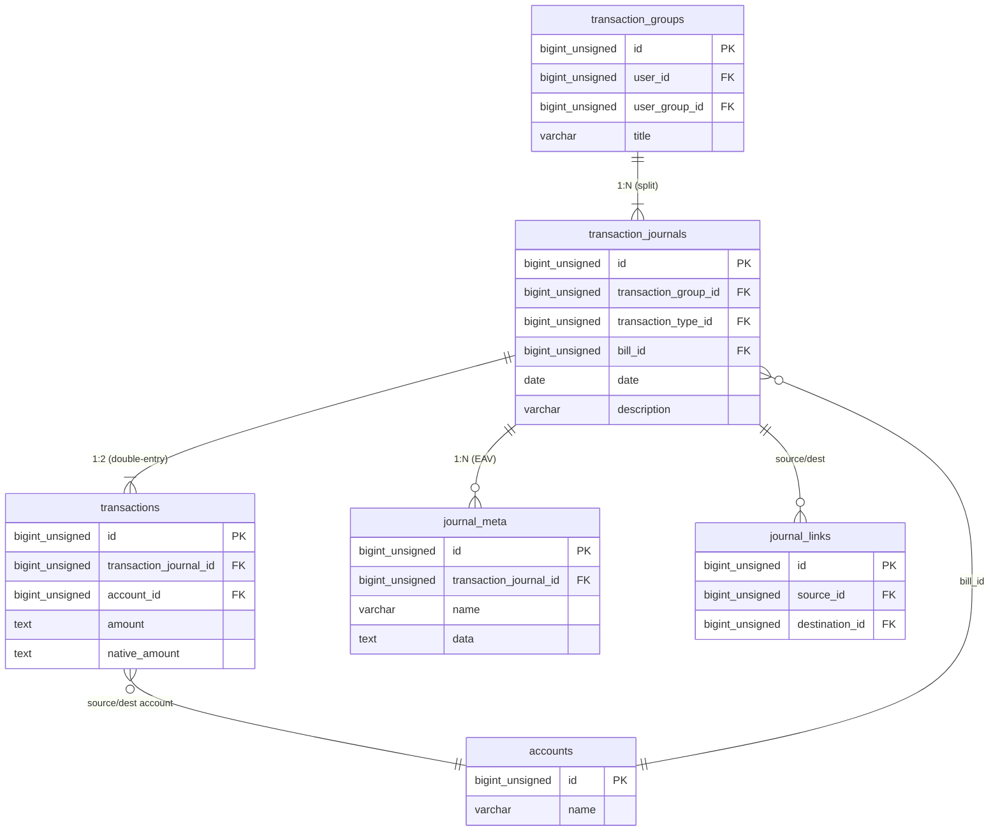

### Contoh Data: Transfer Rp 500.000

```
TransactionGroup #1 (title: null)
  └── TransactionJournal #1 (type: transfer, desc: "Transfer ke BCA")
        ├── Transaction #1 (account: Mandiri, amount: "-500000")    ← SOURCE
        └── Transaction #2 (account: BCA, amount: "500000")         ← DESTINATION

TransactionGroup #2 (title: "Split lunch")
  ├── TransactionJournal #1 (type: withdrawal, desc: "Makan siang")
  │     ├── Transaction #1 (account: BCA, amount: "-35000")       ← SOURCE
  │     └── Transaction #2 (account: Restoran, amount: "35000")    ← DESTINATION
  └── TransactionJournal #2 (type: withdrawal, desc: "Minum")
        ├── Transaction #3 (account: BCA, amount: "-15000")       ← SOURCE
        └── Transaction #4 (account: Kopi, amount: "15000")        ← DESTINATION
```

---

## 3. UserGroup & RBAC

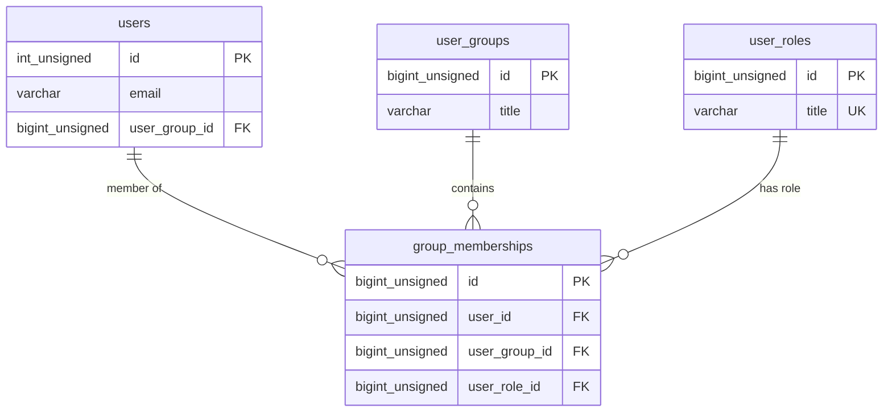

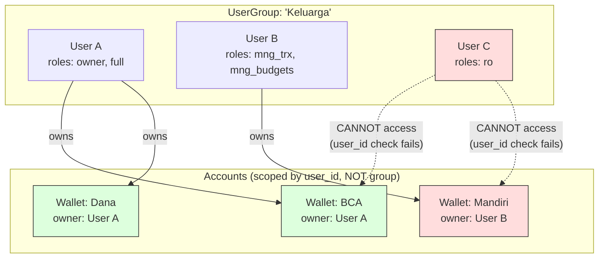

> **Problem**: User C punya role `ro` (read-only) di group, tapi TIDAK bisa akses wallet manapun karena account access dicek via `user_id`, bukan group membership.

---

## 4. Wallet Sharing Model (Go API Baru)

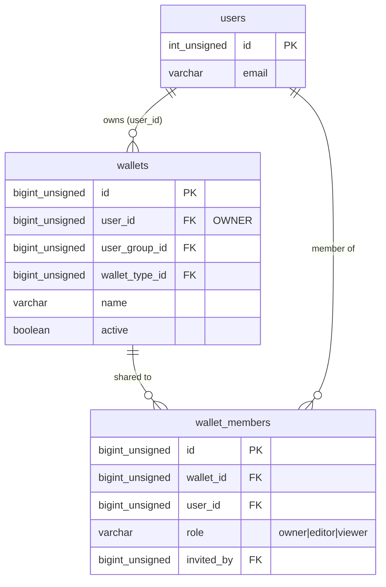

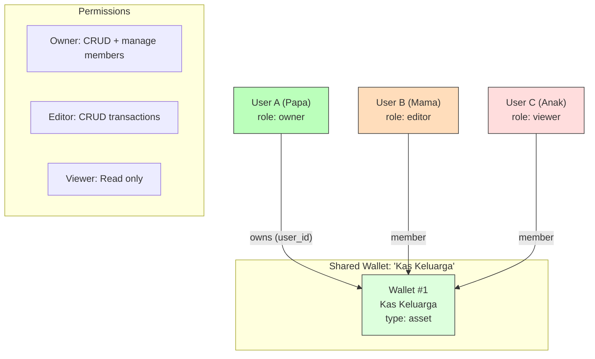

---

## 5. Polymorphic Relationships

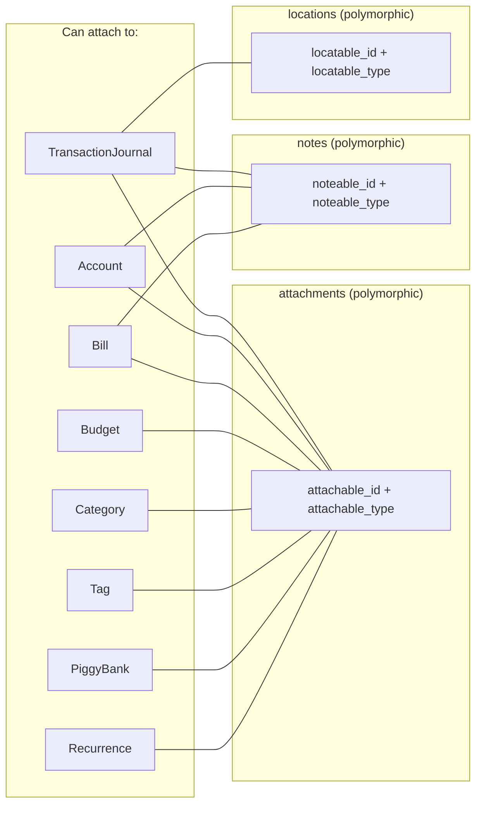

---

## 6. Webhook Lifecycle

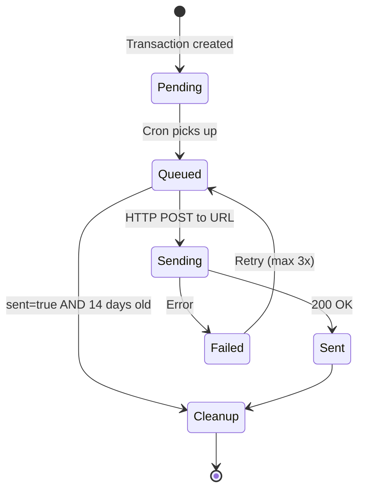

---

## 7. Rule Engine Flow

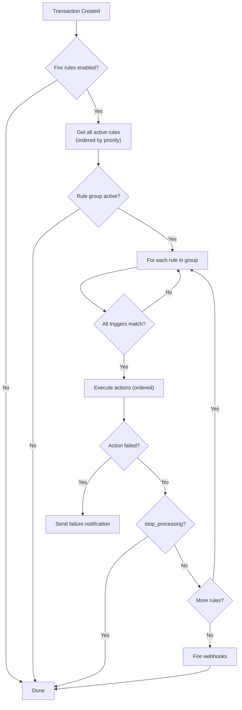

---

## 8. Transaction Create Side Effects

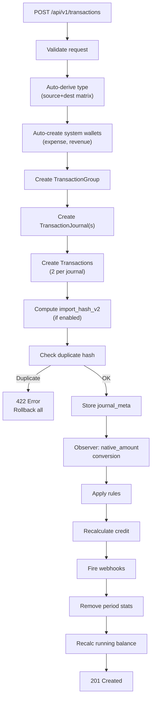

---

## 9. API Auth Flow

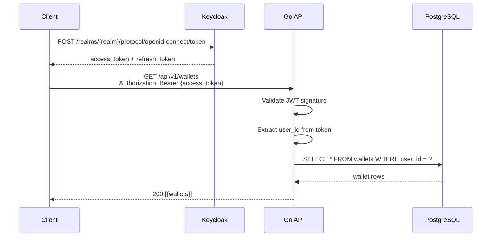

---

## 10. Complete Domain Grouping

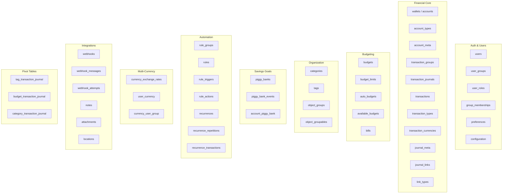
